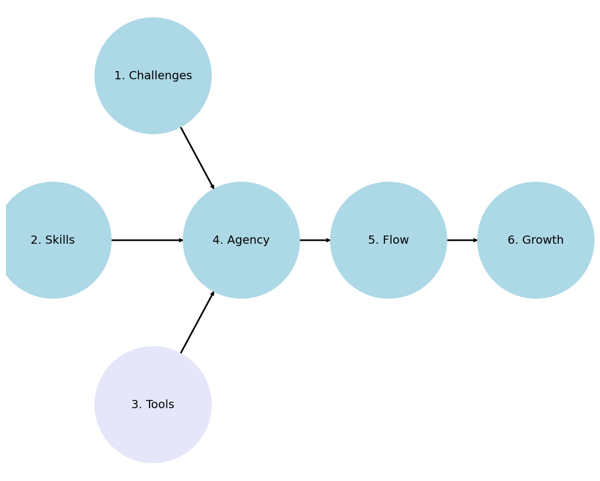

                                   1. Numeracy
                                               \
                                      2. GUI -> 4. Web -> 5. Admin -> 6. Software
                                               /
                                               3. Tools

### Personal 1, 2, [3](https://www.python.org)
### Interpersonal 4
### Group 5, 6

# Usage

To quickly run Python code that I provide, you can follow these steps:

1. **Install Python**: Make sure you have Python installed on your machine. You can download it from [python.org](https://www.python.org/).

2. **Set Up a Virtual Environment**: It's a good practice to create a virtual environment for your projects to manage dependencies.

    ```bash
    python -m venv myenv
    ```

3. **Activate the Virtual Environment**:

    - On Windows:
      ```bash
      myenv\Scripts\activate
      ```
    - On macOS and Linux:
      ```bash
      source myenv/bin/activate
      ```

4. **Install Necessary Packages**: Use `pip` to install any packages required for the code. I will usually list them if they are needed.

    ```bash
    pip install package_name
    ```

5. **Run the Python Script**: Save the code I provide into a `.py` file (e.g., `script.py`) and run it using the Python interpreter.

    ```bash
    python script.py
    ```

Alternatively, you can use Jupyter Notebook or VSCode for an interactive environment:

### Using Jupyter Notebook

1. **Install Jupyter**:
    ```bash
    pip install jupyterlab
    ```

2. **Launch Jupyter Notebook**:
    ```bash
    jupyter notebook
    ```

3. **Create a New Notebook**: In your browser, create a new notebook and copy-paste the code into a cell. Run the cell to execute the code.

### Using VSCode

1. **Install VSCode**: Download and install [VSCode](https://code.visualstudio.com/).

2. **Install Python Extension**: Open VSCode and install the Python extension from the Extensions marketplace.

3. **Open a New File**: Create a new Python file (e.g., `script.py`), paste the code, and save the file.

4. **Run the Code**: You can run the code directly in VSCode by right-clicking the file and selecting "Run Python File in Terminal."

These methods should provide you with quick and efficient ways to run Python code on your machine.


```python
import networkx as nx
import matplotlib.pyplot as plt

G = nx.DiGraph()
G.add_node("1. Root", pos=(-2500, 700))
G.add_node("2. Pentatonic", pos=(-4200, 0))
G.add_node("3. Diatonic", pos=(-2500, -700))
G.add_node("4. Chromatic", pos=(-1000, 0))
G.add_node("5. Temperament", pos=(1500, 0))
G.add_node("6. Expression", pos=(4000, 0))

G.add_edges_from([("1. Root", "4. Chromatic")])
G.add_edges_from([("2. Pentatonic", "4. Chromatic")])
G.add_edges_from([("3. Diatonic", "4. Chromatic")])
G.add_edges_from([("4. Chromatic", "5. Temperament")])
G.add_edges_from([("5. Temperament", "6. Expression")])

pos = nx.get_node_attributes(G, 'pos')
labels = {"4. Chromatic": "4. Agency",
          "1. Root": "1. Challenges",
          "2. Pentatonic": "2. Skills",
          "3. Diatonic": "3. Tools",
          "5. Temperament": "5. Flow",
          "6. Expression": "6. Growth"}  # Added label for "NDI" node in the labels dictionary

# Update color for the "Scenarios" node
node_colors = ["lightblue","lightblue", "lightblue", "lavender", "lightblue", "lightblue"]
# node_colors = ["lightblue","lavender", "lavender", "lightgreen", "lightpink", "lightpink"]
# Suppress the deprecation warning
import warnings
warnings.filterwarnings("ignore", category=DeprecationWarning)

plt.figure(figsize=(10, 8))
nx.draw(G, pos, with_labels=False, node_size=20000, node_color=node_colors, linewidths=2, edge_color='black', style='solid')
nx.draw_networkx_labels(G, pos, labels, font_size=14) # , font_weight='bold'
nx.draw_networkx_edges(G, pos, edge_color='black', style='solid', width=2)
plt.xlim(-5000, 5000)
plt.ylim(-1000, 1000)
plt.axis("off")
plt.show()
```
